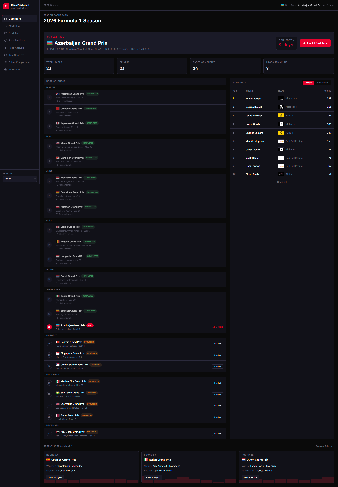
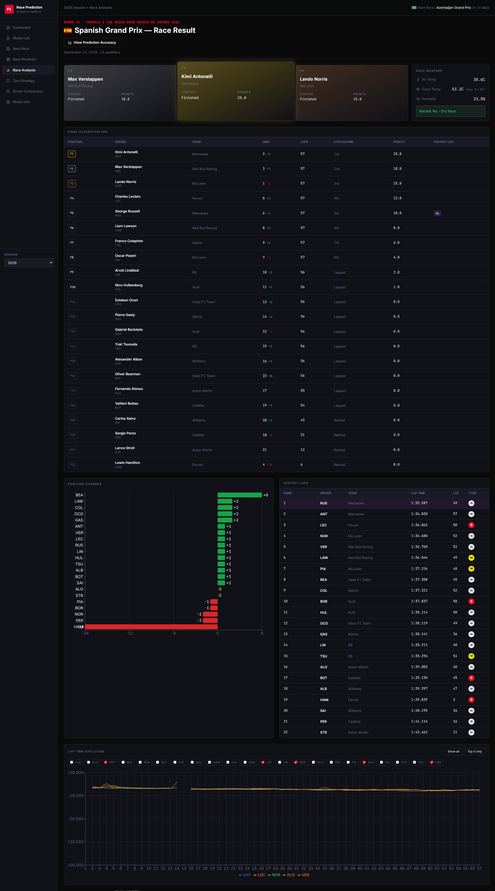
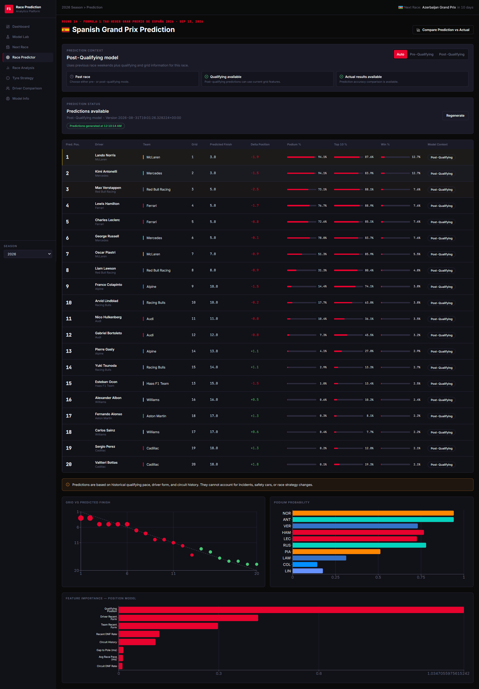
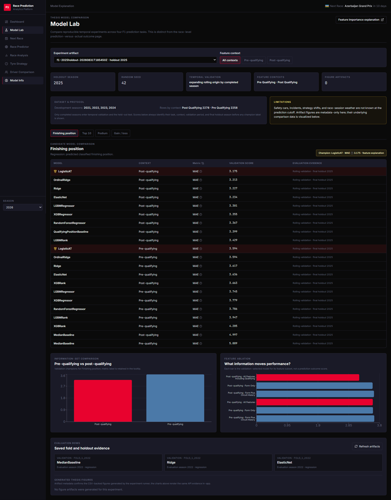

# ApexInsight — F1 Race Prediction Platform

ApexInsight is a BSc thesis project combining Formula 1 analytics with driver-level race predictions. It ingests FastF1/Jolpica data into PostgreSQL, builds historical features, compares machine-learning models with chronological validation, and presents analytics and persisted experiment evidence in a React dashboard.

The thesis investigates four tasks—finishing position, Top 10, podium, and position gain/loss—before and after qualifying. It compares linear, tree-based, ordinal, and ranking models against simple baselines. The contribution is the temporal experiment and comparison of information availability; predictions are estimates, not guaranteed race outcomes.

**Authoritative thesis experiment:** `f1-2025holdout-20260831T185450Z`. Development uses 2021–2024, rolling validation uses 2022/2023/2024, and the completed 2025 season is the final holdout. The seed is 42. Weather and the duplicate grid-position predictor are excluded from the fitted feature sets.

## Dashboard

| Season overview | Race analysis |
| --- | --- |
|  |  |
| Race predictor | Model Lab |
|  |  |

Screenshots show local example data. Model Lab reports saved experiments; it does not train models.

## Architecture and repository

```text
FastF1 / Jolpica -> ingestion -> PostgreSQL -> temporal feature engineering
                                            -> model training / frozen evidence
                                            -> FastAPI -> React dashboard
```

- `f1-platform/backend/app/`: FastAPI routes, services, schemas, database models, and inference.
- `f1-platform/backend/ingestion/`: core, results, laps/weather, and upcoming-weekend ingestion.
- `f1-platform/backend/ml_pipeline/`: feature engineering, temporal experiments, statistics, and figures.
- `f1-platform/backend/alembic/`: versioned database migrations.
- `f1-platform/backend/tests/` and `verification/`: unit tests and in-memory workflow checks.
- `f1-platform/backend/models_store/experiments/f1-2025holdout-20260831T185450Z/`: the frozen 25-file thesis bundle.
- `f1-platform/frontend/`: React/TypeScript dashboard and its locked npm dependencies.
- `scripts/rebuild-f1-data.ps1`: optional full data/training workflow.
- `docs/`: [methodology](docs/ml-experiment-design.md), [results and limitations](docs/final-experiment-results.md), [Model Lab API](docs/model-lab-api.md), and selected figures.

The stack is FastAPI, SQLAlchemy/Alembic, PostgreSQL 16, pandas/scikit-learn/XGBoost/LightGBM, and React/Vite. Python dependencies are pinned in `backend/requirements.txt`; npm dependencies are locked in `frontend/package-lock.json`.

## Prerequisites

- Git and Docker with the Compose v2 plugin; start Docker Desktop on Windows.
- PowerShell for the commands below and the optional rebuild script.
- Internet access for the first image/dependency build and any data ingestion.

Containers provide Python 3.11 and Node.js 20. A host Python environment is not required. Full lap ingestion and nested model training can take substantial time and disk space; neither is required to inspect the frozen results.

## Setup and frozen models

From the cloned repository root:

```powershell
Set-Location f1-platform
Copy-Item .env.example .env
Copy-Item frontend/.env.example frontend/.env
```

Edit `.env` for your environment. Keep `DATABASE_URL` credentials consistent with the three `POSTGRES_*` values. Example passwords are development placeholders.

Install the frozen champion models and metadata into the runtime model store:

```powershell
$thesisExperiment = "backend/models_store/experiments/f1-2025holdout-20260831T185450Z"
Copy-Item -Path "$thesisExperiment/champions/*" -Destination backend/models_store
```

This copies eight models and four metadata/importance files. The runtime copies are ignored by Git; the versioned originals remain in the experiment bundle. Repeating this command replaces the runtime models with the thesis champions.

Build, initialize the database, and start the dashboard:

```powershell
docker compose build
docker compose up -d db
docker compose run --rm ingestion alembic upgrade head
docker compose up -d backend frontend
docker compose ps
```

- Dashboard: [http://localhost:5173](http://localhost:5173)
- API documentation: [http://localhost:8000/api/docs](http://localhost:8000/api/docs)
- Health: [http://localhost:8000/health](http://localhost:8000/health)

The database initially contains only the schema. Model Lab can show the bundled experiment before ingestion; race analytics and prediction generation require race data/features. Copying models does not populate the database.

This Compose configuration is for local development: it uses bind mounts, automatic backend reload, and exposed ports. Models are mounted from the host rather than baked into Docker images. A production deployment needs separate authentication, networking, and process configuration.

## Environment variables

| Variable | Purpose |
| --- | --- |
| `POSTGRES_DB`, `POSTGRES_USER`, `POSTGRES_PASSWORD` | PostgreSQL initialization settings. Changing them does not reconfigure an existing database volume. |
| `DATABASE_URL` | Backend/ingestion connection URL. In Compose use hostname `db` and port `5432`; host database tools use `localhost:5433`. |
| `ENVIRONMENT` | Use `development` for this setup; also accepts `test` or `production`. |
| `API_KEY` | Required by the backend's `X-API-Key` middleware in production. The development dashboard does not implement a production login flow. |
| `FASTF1_CACHE_PATH` | Container cache directory; default/example `/app/cache`. |
| `MODELS_STORE_PATH` | Runtime model directory; default/example `/app/models_store`. |
| `CORS_ORIGINS` | JSON array of allowed frontend origins. |
| `VITE_API_URL` | Frontend API base URL, configured in `frontend/.env`. |

Real environment files, caches, backups, and generated workspaces stay local. Never put private credentials in a `VITE_*` variable: frontend values are shipped to the browser.

## Data ingestion

Run these commands from `f1-platform` after migrations. They acquire completed seasons needed by the thesis workflow:

```powershell
docker compose run --rm ingestion python ingestion/ingest_core.py --seasons 2021 2022 2023 2024 2025
docker compose run --rm ingestion python ingestion/ingest_results.py --seasons 2021 2022 2023 2024 2025
docker compose run --rm ingestion python ingestion/ingest_laps.py --seasons 2021 2022 2023 2024 2025
docker compose run --rm ingestion python ml_pipeline/feature_engineering.py --seasons 2021 2022 2023 2024 2025 --force
```

Result ingestion falls back to Jolpica when FastF1 fails or returns incomplete results. Providers may rate-limit requests; the rebuild script processes result seasons separately with retry settings and pauses. After correcting/re-ingesting results, regenerate features with `--force` so stale feature rows are removed.

The thesis snapshot has no 2022 lap data; missing pace features are imputed using training-fold medians. A new ingestion may recover different data and therefore produce different fingerprints and metrics. Incomplete 2026 data is not thesis validation evidence.

## Frozen evidence versus a new experiment

**Inspect the reported thesis results:** use the bundled CSV/JSON files or Model Lab with an explicit `experiment_id=f1-2025holdout-20260831T185450Z`. No retraining is needed. Model Lab's default is the latest successful local experiment, which can change after a new run.

**Rerun the methodology:** after ingestion/features, run:

```powershell
docker compose run --rm ingestion python ml_pipeline/train_models.py --train-seasons 2021 2022 2023 2024 --evaluation-seasons 2025 --min-train-seasons 1 --context all --seed 42 --artifact-output-dir models_store --model-output-dir models_store --generate-plots
```

This creates a new timestamped experiment and promotes its champions to the runtime store. Do not reuse the frozen thesis ID. Restart the backend after changing runtime models:

```powershell
docker compose restart backend
```

From the repository root, `./scripts/rebuild-f1-data.ps1` automates migrations, ingestion, features, and training. `-SkipTraining` omits model fitting; `-SkipLapIngestion` omits lap acquisition; `-BackupFirst` saves a local database dump. **`-ResetDatabase` runs `docker compose down -v` and removes the database volume.** It is not needed for normal setup or verification.

The bundle records folds, package versions, parameters, and data fingerprints, but it does not contain the original database snapshot or a training Git commit/dirty-state record. It supports inspection/recalculation of saved evaluation evidence; exact end-to-end retraining cannot be guaranteed from changing upstream data alone.

## Tests and verification

With the containers running, execute from `f1-platform`:

```powershell
docker compose exec -T backend python -m unittest discover -s tests
docker compose exec -T backend python verification/verify_future_races.py
docker compose exec -T backend python verification/verify_next_race_prediction_api.py
docker compose exec -T backend python verification/verify_prediction_comparison.py
docker compose exec -T backend python verification/verify_prediction_contexts.py
docker compose exec -T backend python verification/verify_prediction_workflow_e2e.py
docker compose exec -T frontend npm run lint
docker compose exec -T frontend npm run build
docker compose exec -T frontend npm run verify:prediction-routes
docker compose exec -T backend python -c "from app.ml.model_loader import load_all_models, model_store; load_all_models(); assert len(model_store.models_by_context) == 2; assert all(len(models) == 4 and all(model is not None for model in models.values()) for models in model_store.models_by_context.values()); print('All eight models loaded')"
```

The verification scripts use in-memory fixtures; they do not reset the application database. The frontend route check is a static source smoke check, not a browser end-to-end test.

For diagnostics use `docker compose logs backend` or `docker compose logs frontend`. Stop containers with `docker compose down`; omit `-v` to preserve the database.

## Limitations and attribution

Race incidents, strategy changes, reliability failures, and competitive/regulatory changes limit predictive performance. Historical results do not guarantee performance in later seasons. These are analytical predictions, not betting guidance.

Data is acquired through FastF1 and Jolpica. Team marks and linked images belong to their respective owners; this is an independent academic project, not an official Formula 1 product. The submitted thesis files and intermediate document workspaces remain local; the public results document explains the evaluation populations used for the reported metrics.
