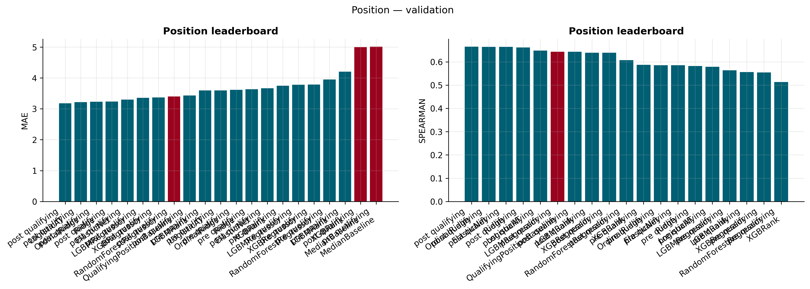
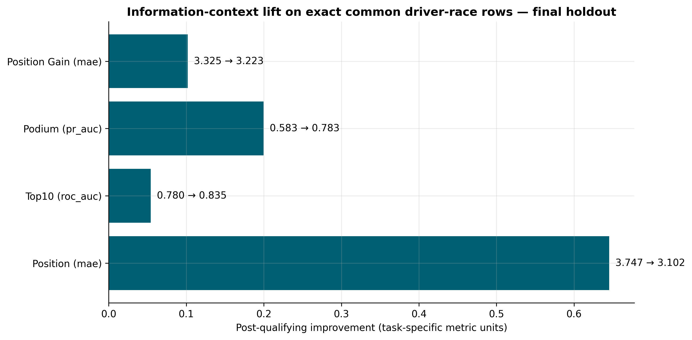

# Final thesis experiment results

## Authoritative record

- Experiment: `f1-2025holdout-20260831T185450Z`
- Completed: `2026-08-31T19:01:26.328224+00:00`
- Development seasons: 2021, 2022, 2023, 2024
- Rolling validation: 2021 -> 2022; 2021–2022 -> 2023; 2021–2023 -> 2024
- Final holdout: completed season 2025
- Seed: 42; both pre-qualifying and post-qualifying contexts

The [frozen bundle](../f1-platform/backend/models_store/experiments/f1-2025holdout-20260831T185450Z/) contains 25 files. Its eight champions and four metadata/importance files match the deployed thesis models. The validation tables and figure provenance used in the final thesis identify this run.

The six historical predictors are pace, driver/team form, circuit finish/DNF history, and recent DNF rate. Post-qualifying adds qualifying position and gap to pole. Target-race weather and the duplicate grid-position predictor are excluded. Official grid remains part of the gain/loss target.

## Validation-selected champions

Selection uses the mean primary score across the three chronological validation seasons. Lower MAE and higher ROC-AUC/PR-AUC are better.

| Task | Context | Champion | Primary metric | Validation mean |
| --- | --- | --- | --- | ---: |
| Position | Pre | LogisticAT | MAE | 3.5939 |
| Position | Post | LogisticAT | MAE | 3.1749 |
| Top 10 | Pre | LGBMClassifier | ROC-AUC | 0.8223 |
| Top 10 | Post | RandomForestClassifierCalibrated | ROC-AUC | 0.8588 |
| Podium | Pre | RandomForestClassifierCalibrated | PR-AUC | 0.5454 |
| Podium | Post | LogisticRegression | PR-AUC | 0.6738 |
| Gain/loss | Pre | ZeroChangeBaseline | MAE | 3.6449 |
| Gain/loss | Post | ElasticNet | MAE | 3.5479 |

Source: `aggregate_results.csv`. The final holdout does not select these champions. The ordinal model narrowly leads the position task; boosted/calibrated classifiers also win some tasks, so the earlier claim that simple linear/logistic models win all remaining tasks no longer describes this experiment.

## Final 2025 holdout: all eligible rows in each context

These results use **472 pre-qualifying rows** or **478 post-qualifying rows**, across 24 races. Model and baseline scores in each row use the same context-specific population.

| Task | Context | Champion | Metric | Champion score | Baseline | Baseline score |
| --- | --- | --- | --- | ---: | --- | ---: |
| Position | Pre | LogisticAT | MAE | 3.7521 | Median | 4.9746 |
| Position | Post | LogisticAT | MAE | 3.1130 | Qualifying position | 3.3431 |
| Top 10 | Pre | LGBMClassifier | ROC-AUC | 0.7810 | Prevalence | 0.5000 |
| Top 10 | Post | RandomForestClassifierCalibrated | ROC-AUC | 0.8364 | Prevalence | 0.5000 |
| Podium | Pre | RandomForestClassifierCalibrated | PR-AUC | 0.5834 | Prevalence | 0.1525 |
| Podium | Post | LogisticRegression | PR-AUC | 0.7832 | Prevalence | 0.1506 |
| Gain/loss | Pre | ZeroChangeBaseline | MAE | 3.3220 | Zero change | 3.3220 |
| Gain/loss | Post | ElasticNet | MAE | 3.2354 | Zero change | 3.3473 |

Source: `final_holdout_results.csv`; the [derived baseline summary](figures/champion_vs_baseline_summary.csv) also records validation and holdout comparisons.

Position and gain/loss improvements over the post-qualifying domain baselines are modest. The zero-change winner before qualifying is a useful negative result: historical features did not justify choosing a more complex gain/loss model on validation.

## Direct context comparison: 471 shared rows

Pre/post contexts contain different eligible entries. Their direct comparison therefore uses only the **471 common driver-race rows**.

| Task | Metric | Pre | Post | Improvement |
| --- | --- | ---: | ---: | ---: |
| Position | MAE | 3.7473 | 3.1019 | 0.6454 reduction |
| Top 10 | ROC-AUC | 0.7805 | 0.8346 | 0.0542 increase |
| Podium | PR-AUC | 0.5835 | 0.7832 | 0.1998 increase |
| Gain/loss | MAE | 3.3248 | 3.2229 | 0.1019 reduction |

Source: [context_lift_common_subset.csv](figures/context_lift_common_subset.csv), derived from saved predictions by `ml_pipeline/thesis_visualizations.py`.

These compare the validation-selected model for each context, not one fixed estimator with a feature switched on/off. They are descriptive comparisons, not causal effects.

**Population clarification:** Table 5 in the submitted thesis uses common-subset model values while its caption and most baseline values refer to full context-specific populations. The two tables above separate these calculations explicitly. The submitted documents and frozen experiment outputs are preserved; this reporting clarification requires no retraining.

## Statistical evidence

`significance.json` contains race-cluster bootstrap intervals and paired comparisons of each champion with its validation runner-up, using 68 aligned validation races. Differences are champion minus runner-up on **MAE for regression** and **Brier score for classification**.

| Task/context | Runner-up | Paired loss difference 95% interval | Two-sided p |
| --- | --- | --- | ---: |
| Position / Pre | OrdinalRidge | [-0.0558, 0.0611] | 0.9714 |
| Position / Post | OrdinalRidge | [-0.0990, 0.0158] | 0.1866 |
| Top 10 / Pre | LogisticRegression | [-0.0077, 0.0036] | 0.5233 |
| Top 10 / Post | LogisticRegression | [-0.0062, 0.0029] | 0.4505 |
| Podium / Pre | XGBClassifier | [-0.0434, -0.0302] | 0.0002 |
| Podium / Post | RandomForestClassifierCalibrated | [0.0347, 0.0468] | 0.0002 |
| Gain/loss / Pre | ElasticNet | [-0.1612, -0.0891] | 0.0002 |
| Gain/loss / Post | Ridge | [-0.0119, 0.0011] | 0.1188 |

Most close selections do not demonstrate a clear paired-loss advantage. For podium after qualifying, Logistic Regression wins validation PR-AUC but has worse Brier loss than the calibrated Random Forest; the positive interval must not be described as proof of PR-AUC superiority. Primary classification intervals use pooled predictions, while selection averages season scores and paired tests weight races. These are different estimands.

Calibration/reliability files and feature-ablation tables remain in the bundle for inspection. They should be interpreted alongside the full candidate leaderboard, not used to retrospectively change the holdout-selected narrative.

## Reproduction and limitations

The [README](../README.md) provides commands for installing frozen champions and rerunning the methodology. Model Lab should be queried with the explicit thesis ID when later local runs exist.

The manifest records 420/440/440/479/479 pre-qualifying feature rows and 440/440/440/479/479 post-qualifying feature rows for 2021–2025. These are feature counts, not all task-eligible evaluation counts. The 2022 snapshot has no lap data, and missing pace values are imputed within training folds.

The bundle preserves the original configuration, CSV/JSON evidence, report, and model files without modification. The CSV tables are the detailed numerical source; the generated `report.md` is not a substitute for the complete result tables. The original database snapshot and training Git revision/dirty state are absent. Exact historical retraining is therefore not guaranteed from live upstream data, even with the same seed and pinned dependencies.

Other limitations include correlated driver observations, a small number of seasons, changing regulations/competitive order, unexpected incidents, and internal non-temporal `cv=3` calibration within training data. The holdout is not evidence of future-season guarantees.

## Historical runs

Earlier runs remain local/historical rather than public thesis defaults:

- `f1-2025holdout-20260828T203629Z`: two-fold validation.
- `f1-2025holdout-20260829T172358Z`: three-fold experiment before the later model framework.
- `f1-2025holdout-20260829T221238Z`: initial ordinal/ranking/calibrated framework, superseded by later fixes.
- `f1-2025holdout-20260830T220241Z`: intermediate run preceding the final feature contract.
- June `thesis-final-2025-holdout-20260620*` runs: older experiments retained in repository history.

Their manifests retain their original identities. They must not be relabeled as the August 31 experiment.
